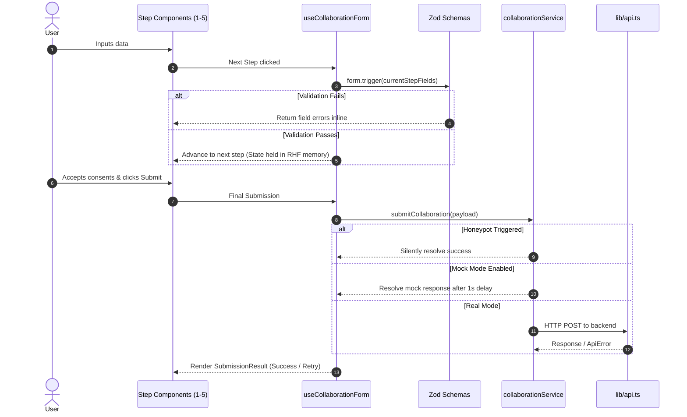

# PSG College of Technology — E-Cell Public Website

> **Frontend Architecture & Work Structure — Revision 3**  
> Modern, resilient, type-safe client-side SPA for the Entrepreneurship Cell (E-Cell) at PSG College of Technology. Built with React, TypeScript, Vite, Tailwind CSS, ShadCN UI, Framer Motion, and Playwright.

---

## 📑 Table of Contents

- [Overview](#-overview)
- [Key Features](#-key-features)
- [Technology Stack](#-technology-stack)
- [Project Architecture & Directory Structure](#-project-architecture--directory-structure)
- [Getting Started](#-getting-started)
  - [Prerequisites](#prerequisites)
  - [Installation](#installation)
  - [Environment Variables](#environment-variables)
  - [Development Scripts](#development-scripts)
- [Collaboration Form Architecture](#-collaboration-form-architecture)
- [Mock-First API Workflow](#-mock-first-api-workflow)
- [Testing Strategy](#-testing-strategy)
- [Coding Guidelines & Rules to Prevent Rework](#-coding-guidelines--rules-to-prevent-rework)
- [Deployment & SPA Hosting](#-deployment--spa-hosting)

---

## 🌟 Overview

The E-Cell Public Website serves as the digital front door for student entrepreneurs, alumni, mentors, corporate partners, and investors engaging with the PSG College of Technology Entrepreneurship Cell.

This project is built around a **mock-first, schema-driven architecture**:
- **Decoupled Frontend Development**: Feature teams can build, test, and polish full interaction workflows independently of backend availability.
- **Single Source of Truth**: Zod schemas power runtime validation, TypeScript type inference (`z.infer`), unit tests, and Playwright E2E suites.
- **Resilient UX**: In-memory multi-step form state persistence, bot protection, route-level error boundaries, and slug-based routing.

---

## ✨ Key Features

- **🏠 Home Page (`/`)**: Hero section, E-Cell overview, vision & objectives, core initiatives, featured project highlights, team preview, and corporate engagement CTA.
- **🚀 Projects Hub (`/projects` & `/projects/:slug`)**: Responsive project gallery with domain tags, project leads, external media/links, and dynamic slug-based detail views with fallback states.
- **👥 Team Directory (`/team`)**: Hierarchical view of E-Cell wings, domains, faculty advisors, and student coordinators with social links (LinkedIn, GitHub, Email).
- **🤝 Corporate Collaboration Multi-Step Form (`/collaboration`)**:
  - **Step 1**: Organization / Company Information
  - **Step 2**: Contact Person Details
  - **Step 3**: Collaboration Domain & Scope
  - **Step 4**: Additional Details & Proposal Upload (PDF/DOCX/PPTX)
  - **Step 5**: Formal Consent & Submission
  - **Post-Submission**: Success & retry-capable error recovery views.
- **🛡️ Bot Protection**: Built-in honeypot field trapping spam bots without degrading user experience.
- **⚡ Performance & Motion**: Framer Motion micro-interactions, responsive drawer navigation, and accessible ShadCN primitives.

---

## 🛠️ Technology Stack

| Category | Technology | Purpose |
| :--- | :--- | :--- |
| **Framework** | [React 18/19](https://react.dev/) + [Vite](https://vitejs.dev/) | Ultra-fast client-side SPA tooling |
| **Language** | [TypeScript](https://www.typescriptlang.org/) | 100% strict type safety; no plain JavaScript |
| **Styling** | [Tailwind CSS](https://tailwindcss.com/) | Utility-first CSS with custom brand design tokens |
| **UI Primitives** | [ShadCN UI](https://ui.shadcn.com/) (Radix UI) | Accessible, unstyled UI primitives in `src/components/ui/` |
| **Animations** | [Framer Motion](https://www.framer.com/motion/) | Smooth step transitions, hero motion, and micro-interactions |
| **Routing** | [React Router](https://reactrouter.com/) | Client-side routing with centralized constants |
| **Form Engine** | [React Hook Form](https://react-hook-form.com/) + `@hookform/resolvers` | In-memory multi-step state management |
| **Validation** | [Zod](https://zod.dev/) | Schema-driven validation & TypeScript inference |
| **Unit Testing** | [Vitest](https://vitest.dev/) | Unit testing schemas, utility helpers, and service mappers |
| **E2E Testing** | [Playwright](https://playwright.dev/) | Cross-browser interaction, visual, and route-interception testing |

---

## 📂 Project Architecture & Directory Structure

```
├── .env.example              # Template for environment variables
├── components.json           # ShadCN CLI configuration
├── playwright.config.ts      # Playwright E2E configuration
├── tsconfig.json             # Root TypeScript config
├── tsconfig.app.json         # Application TypeScript config (includes @/ path alias)
├── vite.config.ts            # Vite build & Vitest test configuration
│
├── public/                   # URL-served static assets
│   ├── projects/             # Static project showcase images (e.g. /projects/slug.jpg)
│   └── team/                 # Static member photos (e.g. /team/member-name.jpg)
│
├── e2e/                      # Playwright end-to-end test suites
│
└── src/
    ├── main.tsx              # Application entry point
    ├── App.tsx               # Root application component with ErrorBoundary & ToastProvider
    ├── router.tsx            # Route tree definitions
    ├── vite-env.d.ts         # Environment variable type declarations
    │
    ├── assets/               # Bundled brand assets (logos, vector graphics, icons)
    ├── styles/               # Global CSS & Tailwind layers (globals.css)
    │
    ├── pages/                # Route-level views
    │   ├── Home/             # / (Landing page)
    │   ├── Projects/         # /projects (Projects listing)
    │   ├── ProjectDetail/    # /projects/:slug (Project deep-dive)
    │   ├── Collaboration/    # /collaboration (5-step partnership form)
    │   ├── Team/             # /team (Team wings & member profiles)
    │   └── NotFound/         # 404 catch-all & bad slug fallback
    │
    ├── components/
    │   ├── layout/           # Navbar, MobileMenu (drawer), Footer
    │   ├── common/           # Container, SectionHeader, ScrollToTop, ErrorBoundary
    │   ├── ui/               # Generated ShadCN primitives (Button, Card, Input, Form, etc.)
    │   ├── home/             # Hero, Overview, Initiatives, Previews, CollaborationCTA
    │   ├── projects/         # ProjectCard, ProjectGrid, ProjectDetails
    │   ├── collaboration/    # StepIndicator, Step 1-5 forms, FileUpload, Result
    │   └── team/             # TeamSection, MemberCard
    │
    ├── data/                 # Static data layer & accessors (getProjects, getTeam)
    ├── types/                # Shared TypeScript models (project.ts, team.ts, collaboration.ts)
    ├── schemas/              # Zod schemas per step + merged collaborationSchema
    ├── services/             # collaborationService.ts (mock mode + real API calls)
    ├── hooks/                # useCollaborationForm.ts, usePageTitle.ts
    └── lib/                  # api.ts (ApiError wrapper), constants.ts, utils.ts (cn)
```

---

## 🚀 Getting Started

### Prerequisites

- **Node.js**: `v18.0.0` or higher
- **Package Manager**: `npm`, `pnpm`, or `yarn`

### Installation

1. Clone the repository:
   ```bash
   git clone https://github.com/PSG-E-Cell/ecell-public-web.git
   cd ecell-public-web
   ```

2. Install dependencies:
   ```bash
   npm install
   ```

3. Configure Environment Variables:
   ```bash
   cp .env.example .env
   ```

### Environment Variables

| Variable | Type | Default | Description |
| :--- | :--- | :--- | :--- |
| `VITE_API_BASE_URL` | `string` | `""` | Target backend REST API base URL |
| `VITE_USE_MOCK_API` | `boolean` | `true` | When `true`, form submissions use built-in mock with simulated latency |
| `VITE_MOCK_SUBMIT_FAILURE` | `boolean` | `false` | When `true`, mock submission forces an `ApiError` to test failure UI |

### Development Scripts

```bash
# Start the local development server (with HMR)
npm run dev

# Run TypeScript type checks
npm run typecheck

# Run unit tests (Vitest)
npm run test

# Run unit tests with coverage report
npm run test:coverage

# Run Playwright E2E tests
npm run test:e2e

# Run Playwright in interactive UI mode
npm run test:e2e:ui

# Build production bundle
npm run build

# Preview production build locally
npm run preview
```

---

## 📝 Collaboration Form Architecture

The `/collaboration` route implements a 5-step form designed with strict resilience principles:



### Key Ownership Rules
1. **Single Form Instance**: One `useForm` instance is created in `useCollaborationForm` with `zodResolver(collaborationSchema)`. Step components consume fields via `useFormContext` / ShadCN `FormField`. **Never create a form per step**.
2. **In-Memory Persistence**: Form data and selected file objects stay preserved across back/forward navigation. No sensitive proposal data is stored in `localStorage`.
3. **Exact Success Message**:
   > *"Thank you for your interest in collaborating with E-Cell. Our team will review your proposal and contact you through the details provided."*

---

## 🔌 Mock-First API Workflow

Frontend development is completely isolated from backend delays:
- **`src/services/collaborationService.ts`** intercepts submissions when `VITE_USE_MOCK_API=true`.
- Supports simulated delays (`~1000ms`), dynamic failure testing (`VITE_MOCK_SUBMIT_FAILURE=true`), and double-submit locking.
- Payload mapping between the requirements specification and backend schemas occurs entirely inside `collaborationService.ts`.

---

## 🧪 Testing Strategy

### Vitest (Unit Tests)
- **Schemas**: Validates required/optional fields, email formats, URLs, allowed file types (PDF, DOC/DOCX, PPT/PPTX), file size limits, and consent requirements.
- **Data & Helpers**: Tests `getProjects()`, `getProjectBySlug()`, `getTeam()`, and payload mappers.

### Playwright (E2E Tests)
- Multi-viewport verification (Desktop: 1280px, Tablet: 768px, Mobile: 375px).
- Full user journeys: Navigation, slug routing, 404 fallbacks, and mobile drawer toggles.
- Complete multi-step collaboration flow tests with route interception (`page.route`).

---

## 📏 Coding Guidelines & Rules to Prevent Rework

1. **No Duplicate UI Primitives**: Use ShadCN primitives in `src/components/ui/` (e.g., `@/components/ui/button`). Do **not** create duplicates like `components/common/Button.tsx`.
2. **Feature Isolation**: Place feature-specific UI in `src/components/<feature>/`. Only promote components to `src/components/common/` if they are genuinely reusable across multiple pages.
3. **Static Data Accessors**: Always access static datasets through functions (`getProjects()`, `getTeam()`). Never import raw arrays directly into page components.
4. **Centralized Constants**: Use `src/lib/constants.ts` for route paths, navigation links, file upload MIME types, and maximum payload sizes.
5. **Type Inference**: Derive form types directly using `z.infer<typeof collaborationSchema>` in `src/types/collaboration.ts`.

---

## 🌐 Deployment & SPA Hosting

This application is a client-side Single Page Application (SPA). The hosting server must rewrite all non-file route requests to `/index.html` to prevent 404 errors on browser refresh.

### Example SPA Fallback Configurations

#### **Vercel (`vercel.json`)**
```json
{
  "rewrites": [
    { "source": "/(.*)", "destination": "/index.html" }
  ]
}
```

#### **Netlify (`_redirects` in `public/`)**
```
/*    /index.html   200
```

#### **Nginx (`nginx.conf`)**
```nginx
location / {
    try_files $uri $uri/ /index.html;
}
```

---

## 🤝 Contributing

1. Create a feature branch: `git checkout -b feature/your-feature-name`
2. Commit changes adhering to project conventions: `git commit -m "feat: add project detail cards"`
3. Verify type checks and test suites: `npm run typecheck && npm run test`
4. Submit a Pull Request.

---

<div align="center">
  <sub>Built with ❤️ by PSG College of Technology Entrepreneurship Cell</sub>
</div>
